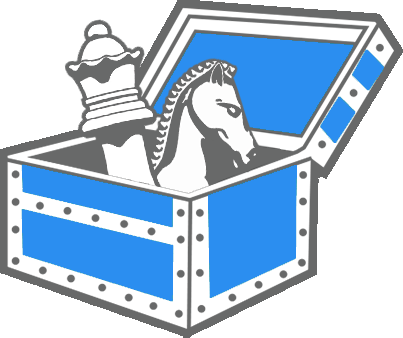

# Community Chess

## Description

Vote on chess moves with people from all over the world. Specifically this is Chess layered on a generic framework for casting asynchronous moves in a given game.

## Building

### Compile All Protos

#### In VSCode

Press _ctrl-shift-p_ to open the command pallet. Search for and run `proto3: Compile All Protos`.

## API

### [V1](docs/v1/api.md)

