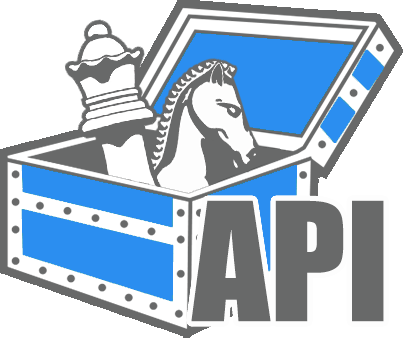

# 
Defines the API as a collection of endpoints and how they map to services.

## Dictionary
- client - Front End, Web UI, Javascript web client.

## Front Endpoints
Simplified set of all endpoints available to the client. For details on any endpoint view its' service description.
| Method | Endpoint                 | Description                                           | Service                 | Request                              | Returns                             |
| ------ | ------------------------ | ----------------------------------------------------- | ----------------------- | ------------------------------------ | ----------------------------------- |
| *      | /login                   | (TODO) Some sort of identity flow for obtaining EUCs. | TODO                    | TODO                                 | TODO                                |
| GET    | /games                   | Collection of publicly available games.              | [MC Server](#mc-server) |                                      | [GamesCollection](#gamecollection)  |
| POST   | /games                   | Create a new game.                                    | [MC Server](#mc-server) | [Game](#game)  |                                     |
| GET    | /game/${gameId}         | Description of game ${gameId}.                        | [Game Server](#game-server) |                                      | [GameMetadata](#gamemetadata) |
| POST   | /game/${gameId}/players | Join (add player) at the game ${gameId}.              | [Game Server](#game-server) | [NewPlayer](#newplayer) | [PlayerToken](#playertoken)         |
| GET | /game/${gameId} | Get game ${gameId}. | [Game Server](#game-server) | | |

## Generic Structures

### Aliases
```Typescript
type PlayerId = string;
type GameId = string;
type ChatId = string;
```

### NewPlayer
```Typescript
class NewPlayer {
    playerId: PlayerId;
}
```

### PlayerToken
```Typescript
class PlayerToken {
    gameId: GameId;
    token: string;
}
```

### Player
```Typescript
{
    playerId: PlayerId,
    nickname: string
}
```

### GamesCollection

```Typescript
class GamesCollection {
    time: Date;
    games: Game[];
}
```

### Game
Implementations: [Chess](#chess)
```Typescript
interface Game {
    gameName: string;
    gameId: GameId;
    chatId: ChatId;
    creationTime: Date;
    metadata: GameMetadata;
    state: GameState;
    players: Player[]
}
```

### GameMetadata
Implementations: [ChessMetadata](#chessmetadata)
```Typescript
interface GameMetadata {
    title: string;
    publiclyVisible: boolean;
    rules: GameRules;
}
```

### GameRules
Implementations: [ChessRules](#chessrules)
```Typescript
interface GameRules {
    voteApplication: VoteApplication;
}
```

### VoteApplicationMethod
Implementations: [VoteAppliedImmediately](#VoteAppliedImmediately), [VoteAppliedAfterTally](#VoteAppliedAfterTally)
```Typescript
interface VoteApplication {
    voteApplicationName: string;
}
```

### VoteAppliedImmediately
```Typescript
class VoteAppliedImmediately implements VoteApplication {
    voteApplicationName: string = "voteAppliedImmediately";
}
```

### VoteAppliedAfterTally

```Typescript
class VoteAppliedAfterTally implements VoteApplication {
    voteApplicationName: string = "voteAppliedAfterTally";
    voteTimeout: number;
    selectionType: SelectionType;
}
```

### SelectionType
```Typescript
enum SelectionType {
    Probability = "PROBABILITY", // Selection is made randomly, more votes means higher probability.
    MostVotes = "MOSTVOTES", // Selection is made by which has the most votes.
}
```

### GameState
Implementations: [ChessState](#chessstate)
```Typescript
interface GameState {}
```

## Chess Structures

### Aliases
```Typescript
type FEN = string; // Forsyth-Edwards Notation
type PGN = string; // Portable Game Notation
```

### Chess
```Typescript
class Chess implements Game {
    gameName: string = "chess";
    gameId: GameId;
    chatId: ChatId;
    creationTime: Date;
    metadata: ChessMetadata;
    state: ChessState;
    players: Player[]
}
```

### ChessMetadata
```Typescript
class ChessMetadata implements GameMetadata {
    title: string;
    publiclyVisible: boolean;
    rules: ChessRules
}
```

### ChessRules
```Typescript
class ChessRules implements GameRules {
    voteApplication: VoteApplication;
    balancedTeams: boolean;
}
```

### ChessState
```Typescript
class ChessState implements GameState {
    turnEnd: Date;
    rounds: ChessRound[];
}
```

### ChessRound
```Typescript
class ChessRound {
    board: FEN;
    votes: ChessVote[];
}
```

### ChessVote
```Typescript
class ChessVote {
    movePGN: PGN;
    voters: PlayerId[];
}
```

TODO(Casting votes, recieving updated state.)


## Services


### MC Server
The Master of Ceremonies Server (MC Server) is responsible for enumerating available games to the client. Exchanging game join requests + EUCs for a game token. 

### Game Server
The Game Server run the actual game. 