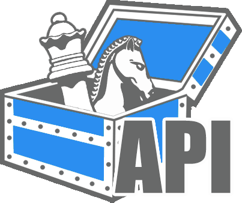

#  V1
Defines the API as a collection of endpoints and how they map to services. [WIP Services API Diagram](https://www.lucidchart.com/invitations/accept/14a7c464-d9c6-49f3-b02c-a36f96ed1ccd)

## Dictionary
- client - Front End, Web UI, Javascript web client.

## Front Endpoints
Simplified set of all endpoints available to the client. For details on any endpoint view its' service description. During usage, endpoints should be appended to the default API path for this version (`api/v1/`).

For example: `GET www.communitychess.com/api/v1/games`


| Method | Endpoint                | Description                                           | Service                           | Request Body            | Return Body                        |
| ------ | ----------------------- | ----------------------------------------------------- | --------------------------------- | ----------------------- | ---------------------------------- |
| *      | /login                  | (TODO) Some sort of identity flow for obtaining EUCs. | TODO                              | TODO                    | TODO                               |
| GET    | /players/${PlayerId}    | Get details of player ${PlayerId}                     | [Players Server](#Players-Server) |                         | [PlayerExtended](#Player-Extended) |
| GET    | /games                  | Collection of publicly available games.               | [MC Server](#mc-server)           |                         | [GamesCollection](#GameCollection) |
| POST   | /games                  | Create a new game.                                    | [MC Server](#mc-server)           | [IGame](#IGame)         | [IGameMetadata](#IGameMetadata)    |
| GET    | /games/${GameId}         | Description of game ${GameId}.                        | [Game Server](#game-server)       |                         | [IGameMetadata](#IGameMetadata)    |
| POST   | /games/${GameId}/players | Join (add player) at the game ${GameId}.              | [Game Server](#game-server)       | [Player](#Player)       |                                    |
| POST   | /games/${GameId}/vote    | Cast a vote to the game ${GameId}.                    | [Game Server](#game-server)       | [IGameVote](#IGameVote) |                                    |

## Base Structures

### Base Aliases
```Typescript
// Unique identifier for a player. Global and one PlayerId per account.
type PlayerId = string;
// Unique identifier for every game created.
type GameId = string;
// Unique identifier for a chat conversation thread. 
type ChatId = string;
```

### Player
Referenced Types: [PlayerId](#Base-Aliases)
```Typescript
class Player {
    playerId: PlayerId;
    nickname: string;
}
```

### PlayerExtended
Refrenced Types: [Player](#Player), [GameId](#Base-Aliases)
```Typescript
class PlayerExtended extends Player {
    email: string;
    username: string;
    games: GameId[];
    // TODO: Figure out OAuth fields.
}
```

### GamesCollection
Referenced Types: [Date](https://developer.mozilla.org/en-US/docs/Web/JavaScript/Reference/Global_Objects/Date), [IGame](#IGame)
```Typescript
class GamesCollection {
    time: Date;
    games: IGame[];
}
```

### IGame
Implementations: [Chess](#chess)

Referenced Types: [GameId](#Base-Aliases), [ChatId](#Base-Aliases), [Date](https://developer.mozilla.org/en-US/docs/Web/JavaScript/Reference/Global_Objects/Date), [IGameMetadata](#IGameMetadata), [IGameState](#IGameState), [Player](#Player)
```Typescript
interface IGame {
    gameName: string;
    gameId: GameId;
    chatId: ChatId;
    creationTime: Date;
    metadata: IGameMetadata;
    state: IGameState;
    players: Player[]
}
```

### IGameMetadata
Implementations: [ChessMetadata](#chessmetadata)

Referenced Types: [IGameRules](#IGameRules)
```Typescript
interface IGameMetadata {
    gameName: string;
    version: number;
    title: string;
    publiclyVisible: boolean;
    rules: IGameRules;
}
```

### IGameRules
Implementations: [ChessRules](#chessrules)

Referenced Types: [IVoteApplication](#IVoteApplication)
```Typescript
interface IGameRules {
    voteApplication: IVoteApplication;
}
```

### IVoteApplication
Implementations: [VoteAppliedImmediately](#VoteAppliedImmediately), [VoteAppliedAfterTally](#VoteAppliedAfterTally)
```Typescript
interface IVoteApplication {
    voteApplicationName: string;
}
```

### VoteAppliedImmediately
```Typescript
class VoteAppliedImmediately implements IVoteApplication {
    voteApplicationName: string = "voteAppliedImmediately";
}
```

### VoteAppliedAfterTally

```Typescript
class VoteAppliedAfterTally implements IVoteApplication {
    voteApplicationName: string = "voteAppliedAfterTally";
    voteTimeout: number;
    selectionType: SelectionType;
}
```

### SelectionType
```Typescript
enum SelectionType {
    Probability = "PROBABILITY", // Selection is made randomly, more votes means higher probability.
    MostVotes = "MOSTVOTES", // Selection is made by which has the most votes.
}
```

### IGameState
Implementations: [ChessState](#chessstate)
```Typescript
interface IGameState {
    gameName: string;
    version: number;
}
```

### IGameVote

```Typescript
interface IGameVote {
    gameName: string;
}
```

## Chess Structures

### Chess Aliases
```Typescript
type FEN = string; // Forsyth-Edwards Notation
type PGN = string; // Portable Game Notation
```

### Chess
Referenced Types: [IGame](#IGame), [GameId](#Base-Aliases), [ChatId](#Base-Aliases), [Date](https://developer.mozilla.org/en-US/docs/Web/JavaScript/Reference/Global_Objects/Date), [ChessMetadata](#ChessMetadata), [ChessState](#ChessState), [Player](#Player)
```Typescript
class Chess implements IGame {
    gameName: string = "chess";
    gameId: GameId;
    chatId: ChatId;
    creationTime: Date;
    metadata: ChessMetadata;
    state: ChessState;
    players: Player[]
}
```

### ChessMetadata
Referenced Types: [IGameMetadata](#IGameMetadata), [ChessRules](#ChessRules)
```Typescript
class ChessMetadata implements IGameMetadata {
    gameName: string = "chess";
    version: number;
    title: string;
    publiclyVisible: boolean;
    rules: ChessRules
}
```

### ChessRules
Referenced Types: [IGameRules](#gamerules), [IVoteApplication](#IVoteApplication)
```Typescript
class ChessRules implements IGameRules {
    voteApplication: IVoteApplication;
    balancedTeams: boolean;
}
```

### ChessState
Referenced Types: [IGameState](#IGameState), [Date](https://developer.mozilla.org/en-US/docs/Web/JavaScript/Reference/Global_Objects/Date), [ChessRound](#ChessRound)
```Typescript
class ChessState implements IGameState {
    gameName: string = "chess";
    version: number;
    turnEnd: Date;
    rounds: ChessRound[];
}
```

### ChessRound
Referenced Types: [FEN](#Chess-Aliases), [ChessVote](#ChessVote)
```Typescript
class ChessRound {
    board: FEN;
    votes: {[playerId: string]: ChessVote;};
}
```

### ChessVote
Referenced Types: [IGameVote](#IGameVote), [PGN](#Chess-Aliases), [PlayerId](#Base-Aliases)
```Typescript
class ChessVote implements IGameVote {
    gameName: string = "chess";
    movePGN: PGN;
    voters: PlayerId[];
}
```

## Services

### Player Server
Manages OAuth flow. Validates identity. Serves requests for [PlayerExtended](#PlayerExtended) objects.

### MC Server
The Master of Ceremonies Server (MC Server) is responsible for enumerating available games to the client. 

### Game Server
The Game Server run the actual game. 


